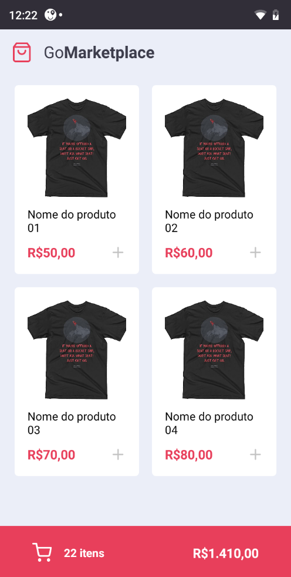
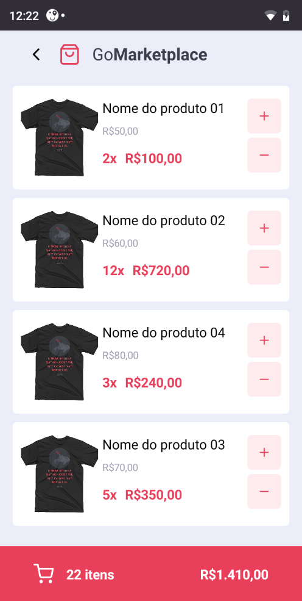

<p align="center">
  
</p>

<h1 align="center">
      Go Marketplace
</h1>

<h4 align="center">
  A simple e-commerce simulator.
</h4>

<p align="center">
    
  
  
  
</p>

<p align="center">
  <a href="#rocket-technologies">Technologies</a>&nbsp;&nbsp;&nbsp;|&nbsp;&nbsp;&nbsp;
  <a href="#warning-prerequisites">Prerequisites</a>&nbsp;&nbsp;&nbsp;|&nbsp;&nbsp;&nbsp;
  <a href="#information_source-getting-started">Getting Started</a>&nbsp;&nbsp;&nbsp;
</p>

This project was taught by Rocketseat on Bootcamp course.

## Show Aplication
<p display="flex" align="center">
    
    
</p>

## :rocket: Technologies

-  [Typescript](https://www.typescriptlang.org/)
-  [React Native](https://reactnative.dev/docs/getting-started)
-  [styled-components](https://www.styled-components.com/)
-  [VS Code](https://code.visualstudio.com/) with [EditorConfig](https://editorconfig.org/) and [ESLint](https://eslint.org/docs/user-guide/getting-started)

## :warning: Prerequisites

To run this aplication you need to download:
- [Git](https://git-scm.com)
- [Yarn v1.13](https://yarnpkg.com/getting-started) - package manager
- [React Native](https://reactnative.dev/docs/getting-started)

  
## :information_source: Getting Started

```bash
# Clone this repository
$ git clone https://github.com/esterandr02/Go-Marketplace.git

# Go into the repository
$ cd Go-Marketplace

# Install dependences
$ yarn

# Run project build
$ yarn android

# Run the app
$ yarn start

# Reload the app (when appear this options)
$ "r"

# Then you can use the app :)
```
Made with ♥ by Ester :wave: [Get in touch!](https://www.linkedin.com/in/ester-albuquerque-3589911a6/)
